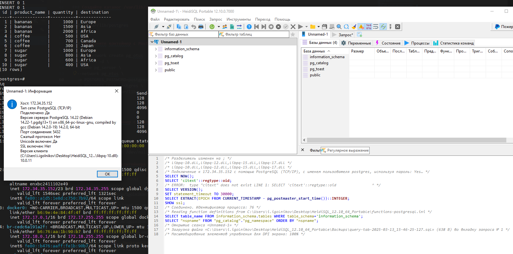

# Домашнее задание
## Установка и настройка PostgteSQL в контейнере Docker.

### Цель:
- Развернуть ВМ ЯО/Аналоги;
- Создайте инстанс с Debian 13;
- Установить Docker;
- Создайте каталог /var/lib/postgres для хранения данных;
- Разверните контейнер с PostgreSQL 14, смонтировав в него /var/lib/postgresql/data;
- Разверните контейнер с клиентом PostgreSQL;
- Подключитесь из контейнера с клиентом к контейнеру с сервером и создайте таблицу с данными о перевозках;
- Подключитесь к контейнеру с сервером с ноутбука или компьютера;
- Удалите контейнер с сервером и создайте его заново;
- Проверьте, что данные остались на месте;

### развернуть ВМ ЯО/Аналоги:
### Создайте инстанс с Debian 13:


### Установить Docker:

```
Add Docker's official GPG key:

sudo apt update
sudo apt install ca-certificates curl
sudo install -m 0755 -d /etc/apt/keyrings
sudo curl -fsSL https://download.docker.com/linux/debian/gpg -o /etc/apt/keyrings/docker.asc
sudo chmod a+r /etc/apt/keyrings/docker.asc
```
```
Add the repository to Apt sources:

sudo tee /etc/apt/sources.list.d/docker.sources <<EOF
Types: deb
URIs: https://download.docker.com/linux/debian
Suites: $(. /etc/os-release && echo "$VERSION_CODENAME")
Components: stable
Architectures: $(dpkg --print-architecture)
Signed-By: /etc/apt/keyrings/docker.asc
EOF
```
```
sudo apt update
sudo apt install docker-ce docker-ce-cli containerd.io docker-buildx-plugin docker-compose-plugin
```

### Создайте каталог /var/lib/postgres для хранения данных:

```
mkdir /var/lib/postgresql/data
```

### Разверните контейнер с PostgreSQL 14, смонтировав в него /var/lib/postgres:
```
docker network create pg_otus
docker run -d \
  --name pg_server \
  --network pg_otus \
  -e POSTGRES_PASSWORD=postgres \
  -e POSTGRES_USER=postgres \
  -v pg_otus_data:/var/lib/postgresql/data \
  -p 5432:5432 \
  postgres:14
```

### Разверните контейнер с клиентом PostgreSQL;
```
docker run -d \
  --name pg_client \
  --network pg_otus \
  postgres:14 tail -f /dev/null
```
### Подключитесь из контейнера с клиентом к контейнеру с сервером и создайте таблицу с данными о перевозках;
```
docker exec -it pg_client psql -h pg_server -U postgres

Password for user postgres:

postgres=#
    CREATE TABLE shipments (
    id serial PRIMARY KEY,
    product_name text,
    quantity int,
    destination text
);

INSERT INTO shipments(product_name, quantity, destination) VALUES('bananas', 1000, 'Europe');
INSERT INTO shipments(product_name, quantity, destination) VALUES('bananas', 1500, 'Asia');
INSERT INTO shipments(product_name, quantity, destination) VALUES('bananas', 2000, 'Africa');
INSERT INTO shipments(product_name, quantity, destination) VALUES('coffee', 500, 'USA');
INSERT INTO shipments(product_name, quantity, destination) VALUES('coffee', 700, 'Canada');
INSERT INTO shipments(product_name, quantity, destination) VALUES('coffee', 300, 'Japan');
INSERT INTO shipments(product_name, quantity, destination) VALUES('sugar', 1000, 'Europe');
INSERT INTO shipments(product_name, quantity, destination) VALUES('sugar', 800, 'Asia');
INSERT INTO shipments(product_name, quantity, destination) VALUES('sugar', 600, 'Africa');
INSERT INTO shipments(product_name, quantity, destination) VALUES('sugar', 400, 'USA');

-- Проверяем
SELECT * FROM shipments;

 id | product_name | quantity | destination
----+--------------+----------+-------------
  1 | bananas      |     1000 | Europe
  2 | bananas      |     1500 | Asia
  3 | bananas      |     2000 | Africa
  4 | coffee       |      500 | USA
  5 | coffee       |      700 | Canada
  6 | coffee       |      300 | Japan
  7 | sugar        |     1000 | Europe
  8 | sugar        |      800 | Asia
  9 | sugar        |      600 | Africa
 10 | sugar        |      400 | USA
(10 rows)

postgres=#

```

### Подключитесь к контейнеру с сервером с ноутбука или компьютера;



### Удалите контейнер с сервером и создайте его заново;
```
docker stop pg_server
docker rm pg_server

docker run -d \
  --name pg_server \
  --network pg_otus \
  -e POSTGRES_PASSWORD=postgres \
  -e POSTGRES_USER=postgres \
  -v pg_otus_data:/var/lib/postgresql/data \
  -p 5432:5432 \
  postgres:14

```
### Проверьте, что данные остались на месте;
```
docker exec -it pg_client psql -h pg_server -U postgres
Password for user postgres:

postgres=# SELECT * FROM shipments;

 id | product_name | quantity | destination
----+--------------+----------+-------------
  1 | bananas      |     1000 | Europe
  2 | bananas      |     1500 | Asia
  3 | bananas      |     2000 | Africa
  4 | coffee       |      500 | USA
  5 | coffee       |      700 | Canada
  6 | coffee       |      300 | Japan
  7 | sugar        |     1000 | Europe
  8 | sugar        |      800 | Asia
  9 | sugar        |      600 | Africa
 10 | sugar        |      400 | USA
(10 rows)

```
