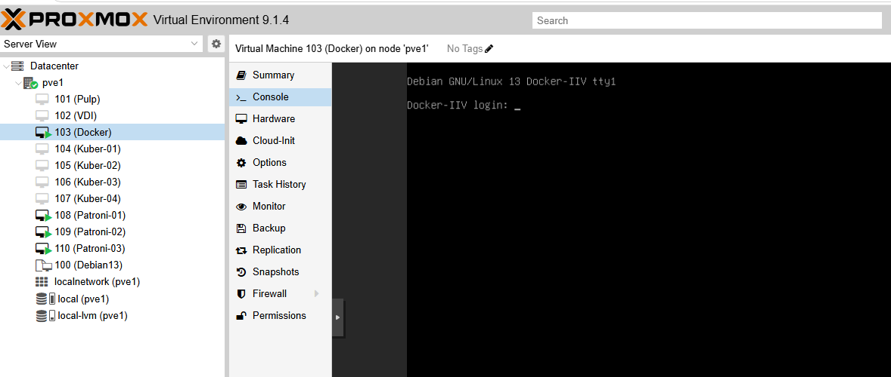

## Публичный репозиторий для проверки домашних заданий от OTUS.

Формат markdown


markdown
# Заголовок 1
## Заголовок 2
### Заголовок 3

**Жирный текст**
*Курсив*

- Список
- Ненумерованный

1. Нумерованный
2. Список

[Ссылка](https://example.com)

`код в строке`

​```python
# Блок кода
print("Hello")
​```

> Цитата

| Таблица | Столбец |
|---------|---------|
| Данные  | Данные  |


скриншоты

