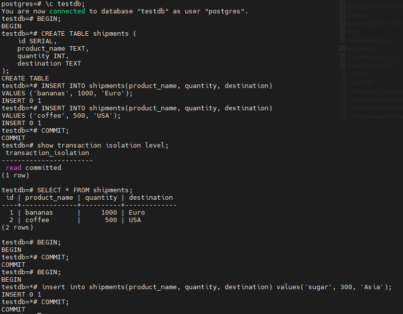
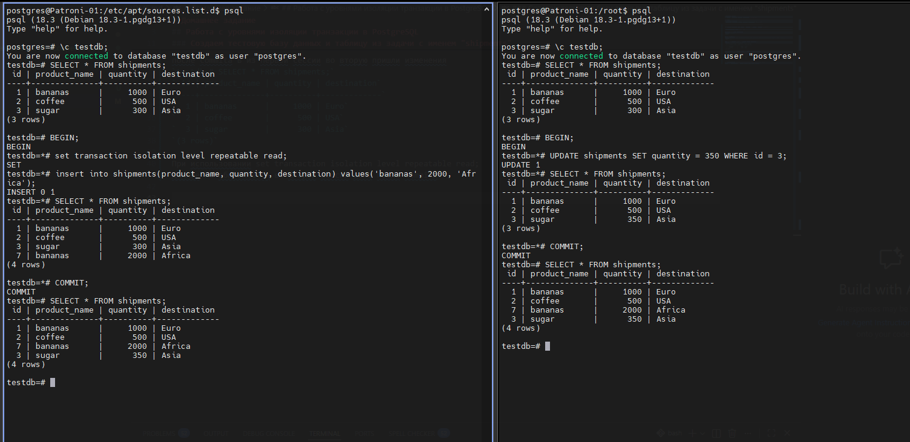

# Домашнее задание:
## Работа с уровнями изоляции транзакции в PostgreSQL

### Цель:
- научиться работать с ЯО;
- научиться управлять уровнем изоляции транзакции в PostgreSQL;

---------------------------------------------------------------

### Создаем тестовую базу данных и таблицу из задачи с именем "shipments"



Открываем для теста транзакцию 
```
testdb=# BEGIN;
BEGIN
```

Вносим изменения
```
testdb=*# insert into shipments(product_name, quantity, destination) values('sugar', 300, 'Asia');
INSERT 0 1
```

пока мы не сделали commit во второй сессии изменений нет
testdb=# SELECT * FROM shipments;
```
 id | product_name | quantity | destination
  1 | bananas      |     1000 | Euro
  2 | coffee       |      500 | USA
(2 rows)
```

после commita из первой сессии во вторую пришли изменения
testdb=# SELECT * FROM shipments;
```
 id | product_name | quantity | destination
  1 | bananas      |     1000 | Euro
  2 | coffee       |      500 | USA
  3 | sugar        |      300 | Asia
(3 rows)
```

При использовании set transaction isolation level repeatable read; 
данные не обновляются во второй сессии даже после commita.



Уровень REPEATABLE READ создаёт снимок данных (snapshot) на момент начала транзакции.
Сессия 2 видит базу данных такой, какой она была в момент выполнения BEGIN
Даже если Сессия 1 сделает COMMIT, Сессия 2 всё равно не увидит новые данные до завершения своей транзакции.
