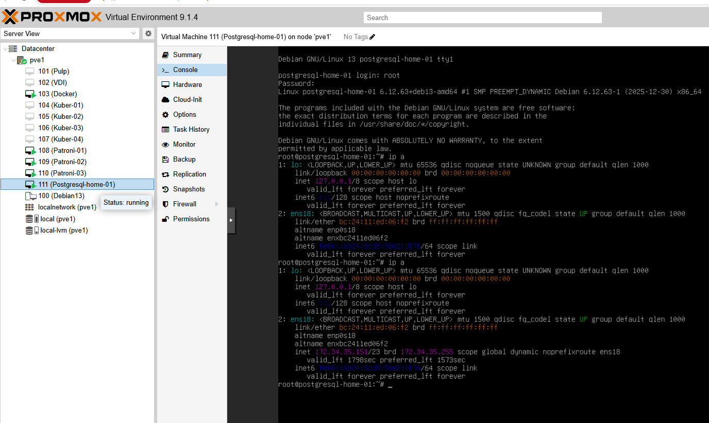
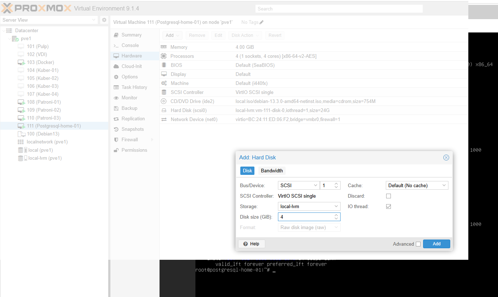

# Домашнее задание:
## Спасение данных на внешнем диске.
### Цель:
- научиться подключать и настраивать дополнительный диск для хранения данных;
- освоить перенос базы данных postgresql на новое хранилище;
- обеспечить отказоустойчивость данных при помощи внешнего диска;


### Создайте виртуальную машину с Debian 13 и установите PostgreSQL 15 или выше.



```
apt update
apt upgrade -y
apt install sudo

sudo apt install -y postgresql-common
sudo /usr/share/postgresql-common/pgdg/apt.postgresql.org.sh

sudo apt update
sudo apt install postgresql-18

psql --version
psql (PostgreSQL) 18.3 (Debian 18.3-1.pgdg13+1)

```
### Создайте таблицу с данными о перевозках.

```
root@postgresql-home-01:~# su postgres
postgres@postgresql-home-01:/root$ psql

create table shipments(id serial, product_name text, quantity int, destination text);

insert into shipments(product_name, quantity, destination) values('bananas', 1000, 'Europe');
insert into shipments(product_name, quantity, destination) values('bananas', 1500, 'Asia');
insert into shipments(product_name, quantity, destination) values('bananas', 2000, 'Africa');
insert into shipments(product_name, quantity, destination) values('coffee', 500, 'USA');
insert into shipments(product_name, quantity, destination) values('coffee', 700, 'Canada');
insert into shipments(product_name, quantity, destination) values('coffee', 300, 'Japan');
insert into shipments(product_name, quantity, destination) values('sugar', 1000, 'Europe');
insert into shipments(product_name, quantity, destination) values('sugar', 800, 'Asia');
insert into shipments(product_name, quantity, destination) values('sugar', 600, 'Africa');
insert into shipments(product_name, quantity, destination) values('sugar', 400, 'USA');

SELECT * FROM shipments;
 id | product_name | quantity | destination
----+--------------+----------+-------------
  1 | bananas      |     1000 | Europe
  2 | bananas      |     1500 | Asia
  3 | bananas      |     2000 | Africa
  4 | coffee       |      500 | USA
  5 | coffee       |      700 | Canada
  6 | coffee       |      300 | Japan
  7 | sugar        |     1000 | Europe
  8 | sugar        |      800 | Asia
  9 | sugar        |      600 | Africa
 10 | sugar        |      400 | USA
(10 rows)

```
### Добавьте внешний диск к виртуальной машине и перенесите туда базу данных.


```
root@postgresql-home-01:~# lsblk
NAME   MAJ:MIN RM  SIZE RO TYPE MOUNTPOINTS
sda      8:0    0   24G  0 disk
├─sda1   8:1    0 22.7G  0 part /
├─sda2   8:2    0    1K  0 part
└─sda5   8:5    0  1.3G  0 part [SWAP]
sdb      8:16   0    4G  0 disk
sr0     11:0    1  754M  0 rom

```

```
mkfs.ext4 /dev/sdb

mke2fs 1.47.2 (1-Jan-2025)
Discarding device blocks: done
Creating filesystem with 1048576 4k blocks and 262144 inodes
Filesystem UUID: c00d13d5-143a-4d9b-a2ab-7b9d42c6cd64
Superblock backups stored on blocks:
32768, 98304, 163840, 229376, 294912, 819200, 884736

Allocating group tables: done
Writing inode tables: done
Creating journal (16384 blocks):
done
Writing superblocks and filesystem accounting information: done

```

```
mkdir -p /mnt/data/
mount /dev/sdb /mnt/data/

df -h
Filesystem      Size  Used Avail Use% Mounted on

/dev/sda1        23G  1.5G   20G   8% /
/dev/sdb        3.9G  1.1M  3.7G   1% /mnt/data

mkdir -p /mnt/data/main/
rsync -avx /var/lib/postgresql/18/main/ /mnt/data/main/

chown -R postgres:postgres /mnt/data/main
chmod 700 /mnt/data/main
```

### Настройте PostgreSQL для работы с новым диском.
```
systemctl stop postgresql - останавливаем службу перед изменением конфигурации

nano /etc/postgresql/18/main/postgresql.conf - меняем "data_directory" на новое место базы
     > #data_directory = '/var/lib/postgresql/18/main'         # use data in another directory
     > data_directory = '/mnt/data/main'

systemctl start postgresql - запускаем службу

systemctl status postgresql - проверяем статус 
● postgresql.service - PostgreSQL RDBMS
     Loaded: loaded (/usr/lib/systemd/system/postgresql.service; enabled; preset: enabled)
     Active: active (exited) since Wed 2026-05-13 21:15:21 EET; 4s ago
 Invocation: d9ff448b24e947a4801b9e784bee3849
    Process: 13188 ExecStart=/bin/true (code=exited, status=0/SUCCESS)
   Main PID: 13188 (code=exited, status=0/SUCCESS)
   Mem peak: 1.7M
        CPU: 9ms

May 13 21:15:21 postgresql-home-01 systemd[1]: Starting postgresql.service - PostgreSQL RDBMS...
May 13 21:15:21 postgresql-home-01 systemd[1]: Finished postgresql.service - PostgreSQL RDBMS.

```
### Проверьте, что данные сохранились и доступны.

```
root@postgresql-home-01:~# su postgres
postgres@postgresql-home-01:/root$ psql

postgres=# SELECT * FROM shipments;

 id | product_name | quantity | destination
----+--------------+----------+-------------
  1 | bananas      |     1000 | Europe
  2 | bananas      |     1500 | Asia
  3 | bananas      |     2000 | Africa
  4 | coffee       |      500 | USA
  5 | coffee       |      700 | Canada
  6 | coffee       |      300 | Japan
  7 | sugar        |     1000 | Europe
  8 | sugar        |      800 | Asia
  9 | sugar        |      600 | Africa
 10 | sugar        |      400 | USA
(10 rows)

```
