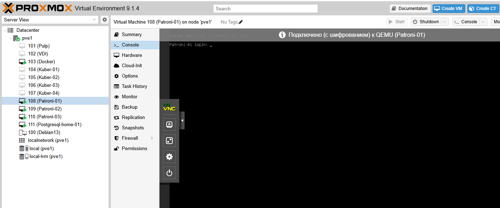
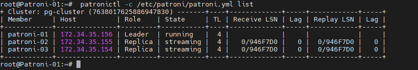

# Домашнее задание:
## Высокая доступность: развертывание Patroni.
### Цель:
- разворачивать отказоустойчивый кластер PostgreSQL для сохранения доступности сервиса при сбое узла;

### Создайте 3 виртуальные машины для etcd и 3 виртуальные машины для Patroni.


### Разверните HA-кластер PostgreSQL с использованием Patroni.


`cat /etc/patroni/patroni.yml`

```
scope: pg-cluster
name: patroni-01

restapi:
  listen: 0.0.0.0:8008
  connect_address: 172.34.35.156:8008

etcd3:
  hosts: 172.34.35.156:2379,172.34.35.155:2379,172.34.35.154:2379

bootstrap:
  dcs:
    ttl: 30
    loop_wait: 10
    retry_timeout: 10
    maximum_lag_on_failover: 1048576
    postgresql:
      use_pg_rewind: true
      use_slots: true
      parameters:
        wal_level: replica
        hot_standby: "on"
        wal_log_hints: "on"
        max_wal_senders: 10
        max_replication_slots: 10
        wal_keep_size: 1024
  initdb:
    - encoding: UTF8
    - data-checksums
  pg_hba:
    - host replication replicator 0.0.0.0/0 md5
    - host all all 0.0.0.0/0 md5

postgresql:
  version: 18
  listen: 0.0.0.0:5432
  connect_address: 172.34.35.156:5432
  data_dir: /var/lib/postgresql/18/main
  bin_dir: /usr/lib/postgresql/18/bin
  authentication:
    replication:
      username: replicator
      password: replicator_password
    superuser:
      username: postgres
      password: SuperSecret123!
    rewind:
      username: rewind_user
      password: RewindSecret123!

tags:
  nofailover: false
  noloadbalance: false
  clonefrom: false
  nosync: false

```

### Настройте HAProxy для балансировки нагрузки.


### Проверьте отказоустойчивость кластера, имитируя сбой на одном из узлов.


### Дополнительно: Настройте бэкапы с использованием WAL-G или pg_probackup.


