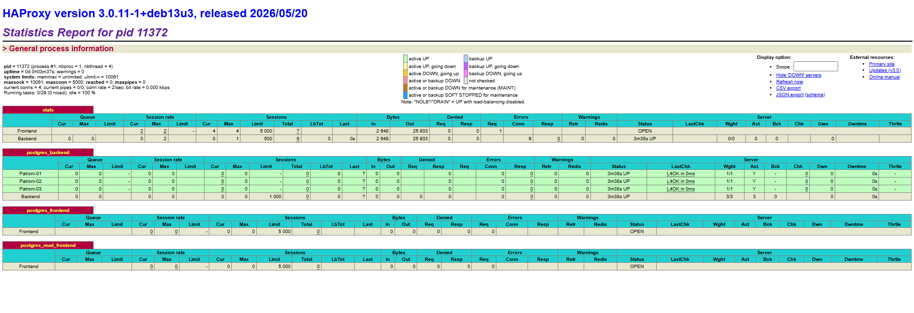
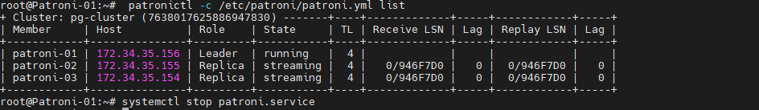
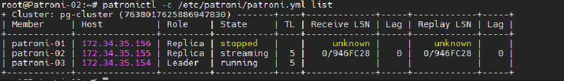
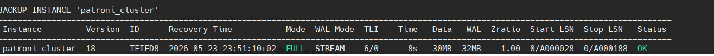

# Домашнее задание:
## Высокая доступность: развертывание Patroni.
### Цель:
- разворачивать отказоустойчивый кластер PostgreSQL для сохранения доступности сервиса при сбое узла;

### Создайте 3 виртуальные машины для etcd и 3 виртуальные машины для Patroni.


### Разверните HA-кластер PostgreSQL с использованием Patroni.

`cat /etc/default/etcd`
```
ETCD_NAME=patroni-01
ETCD_INITIAL_CLUSTER="patroni-01=http://172.34.35.156:2380,patroni-02=http://172.34.35.155:2380,patroni-03=http://172.34.35.154:2380"
ETCD_INITIAL_CLUSTER_TOKEN="pg-cluster"
ETCD_INITIAL_CLUSTER_STATE="new"
ETCD_INITIAL_ADVERTISE_PEER_URLS="http://172.34.35.156:2380"
ETCD_DATA_DIR="/var/lib/etcd/postgresql"
ETCD_LISTEN_PEER_URLS="http://0.0.0.0:2380"
ETCD_LISTEN_CLIENT_URLS="http://0.0.0.0:2379,http://127.0.0.1:2379"
ETCD_ADVERTISE_CLIENT_URLS="http://172.34.35.156:2379"
```
`etcdctl member list`
```
etcdctl member list
21a5e9219e45b423, started, patroni-03, http://172.34.35.154:2380, http://172.34.35.154:2379, false
2b78dcfd28c49bdf, started, patroni-01, http://172.34.35.156:2380, http://172.34.35.156:2379, false
8519938179d3a5c1, started, patroni-02, http://172.34.35.155:2380, http://172.34.35.155:2379, false
```

`patronictl -c /etc/patroni/patroni.yml list`


`cat /etc/patroni/patroni.yml`

```
scope: pg-cluster
name: patroni-01

restapi:
  listen: 0.0.0.0:8008
  connect_address: 172.34.35.156:8008

etcd3:
  hosts: 172.34.35.156:2379,172.34.35.155:2379,172.34.35.154:2379

bootstrap:
  dcs:
    ttl: 30
    loop_wait: 10
    retry_timeout: 10
    maximum_lag_on_failover: 1048576
    postgresql:
      use_pg_rewind: true
      use_slots: true
      parameters:
        wal_level: replica
        hot_standby: "on"
        wal_log_hints: "on"
        max_wal_senders: 10
        max_replication_slots: 10
        wal_keep_size: 1024
  initdb:
    - encoding: UTF8
    - data-checksums
  pg_hba:
    - host replication replicator 0.0.0.0/0 md5
    - host all all 0.0.0.0/0 md5

postgresql:
  version: 18
  listen: 0.0.0.0:5432
  connect_address: 172.34.35.156:5432
  data_dir: /var/lib/postgresql/18/main
  bin_dir: /usr/lib/postgresql/18/bin
  authentication:
    replication:
      username: replicator
      password: replicator_password
    superuser:
      username: postgres
      password: SuperSecret123!
    rewind:
      username: rewind_user
      password: RewindSecret123!

tags:
  nofailover: false
  noloadbalance: false
  clonefrom: false
  nosync: false

```

### Настройте HAProxy для балансировки нагрузки.

`cat /etc/haproxy/haproxy.cfg`

```
global
    log /dev/log local0
    maxconn 5000
    user haproxy
    group haproxy

defaults
    log global
    mode tcp
    timeout connect 5s
    timeout client 30m
    timeout server 30m

listen stats
    bind *:7000
    mode http
    stats enable
    stats uri /stats

# Простой бэкенд без проверок
backend postgres_backend
    mode tcp
    balance roundrobin
    server Patroni-01 172.34.35.156:5432 check
    server Patroni-02 172.34.35.155:5432 check
    server Patroni-03 172.34.35.154:5432 check

frontend postgres_frontend
    bind *:5432
    mode tcp
    default_backend postgres_backend

# Дополнительный порт для чтения
frontend postgres_read_frontend
    bind *:5433
    mode tcp
    default_backend postgres_backend
```


### Проверьте отказоустойчивость кластера, имитируя сбой на одном из узлов.



### Дополнительно: Настройте бэкапы с использованием WAL-G или pg_probackup.

`sudo -u postgres /usr/bin/pg_probackup-18 add-instance -B /mnt/data/ -D /var/lib/postgresql/18/main --instance=patroni_cluster`

`sudo -u postgres /usr/bin/pg_probackup-18 backup -B /mnt/data/ --instance=patroni_cluster -b FULL --stream`
```
INFO: Backup start, pg_probackup version: 2.5.16, instance: patroni_cluster, backup ID: TFIFD8, backup mode: FULL, wal mode: STREAM, remote: false, compress-algorithm: none, compress-level: 1
INFO: This PostgreSQL instance was initialized with data block checksums. Data block corruption will be detected
WARNING: Current PostgreSQL role is superuser. It is not recommended to run pg_probackup under superuser.
INFO: Database backup start
INFO: wait for pg_backup_start()
INFO: Wait for WAL segment /mnt/data/backups/patroni_cluster/TFIFD8/database/pg_wal/00000006000000000000000A to be streamed
INFO: PGDATA size: 30MB
INFO: Current Start LSN: 0/A000028, TLI: 6
INFO: Start transferring data files
INFO: Data files are transferred, time elapsed: 0
INFO: wait for pg_stop_backup()
INFO: pg_stop backup() successfully executed
INFO: stop_lsn: 0/A000188
INFO: Getting the Recovery Time from WAL
INFO: Syncing backup files to disk
INFO: Backup files are synced, time elapsed: 0
INFO: Validating backup TFIFD8
INFO: Backup TFIFD8 data files are valid
INFO: Backup TFIFD8 resident size: 62MB
INFO: Backup TFIFD8 completed
```

