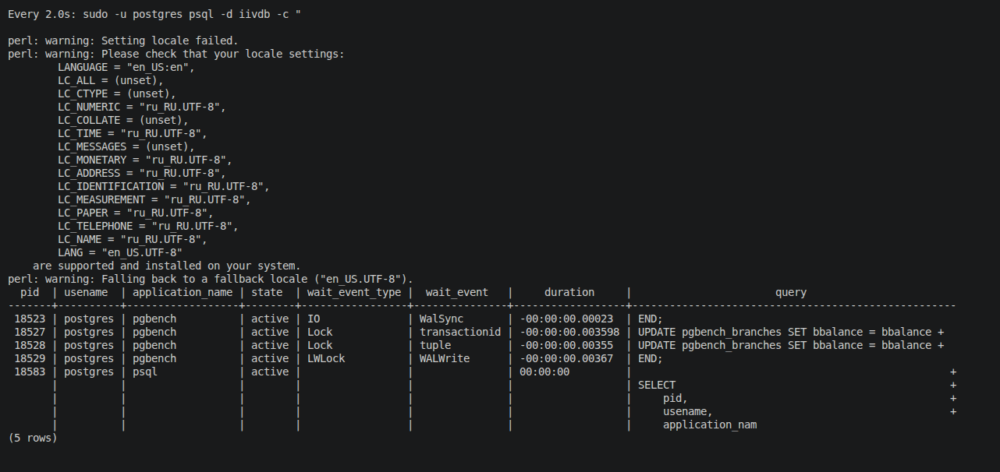

# Домашнее задание:

## Гонка за производительностью

### Цель:

- настроить PostgreSQL для максимальной скорости работы под нагрузкой.
- Как настроить PostgreSQL для максимальной производительности?
- Какие параметры нужно изменить, чтобы ускорить работу системы?
- Как проверить, что оптимизация действительно работает?

### Разверните инстанс PostgreSQL на виртуальной машине:

```
apt update
apt upgrade -y
apt install sudo

sudo apt install -y postgresql-common
sudo /usr/share/postgresql-common/pgdg/apt.postgresql.org.sh

sudo apt update
sudo apt install postgresql-18

psql --version
psql (PostgreSQL) 18.3 (Debian 18.3-1.pgdg13+1)
```

### Протестируйте производительность с помощью pgbench:

```
#инициализируем тестовую базу данныйх с именем iivdb, данными для нагрузочного теста pgbench
sudo -u postgres pgbench -i -s 10 iivdb

#Простой тест на 10 секунд
sudo -u postgres pgbench -T 10 iivdb

#Тест на 60 секунд с отчетом
sudo -u postgres pgbench -T 60 iivdb

# 4 потока, 60 секунд
sudo -u postgres pgbench -c 4 -T 60 iivdb

# 8 потоков, 120 секунд
sudo -u postgres pgbench -c 8 -T 120 iivdb

# С выводом более детальной статистики
sudo -u postgres pgbench -c 4 -T 60 -P 5 iivdb

# Стандартный сценарий (70% чтение, 30% запись)
sudo -u postgres pgbench -c 4 -T 60 -N iivdb

# Сохранить результаты теста
sudo -u postgres pgbench -c 4 -T 60 iivdb > /tmp/pgbench_result.txt

# Или с подробным выводом
sudo -u postgres pgbench -c 4 -T 60 -P 5 iivdb | tee /tmp/pgbench_result.txt
```


### Проверьте, насколько выросла производительность:

```
sudo -u postgres pgbench -c 4 -T 60 -P 5 iivdb
perl: warning: Setting locale failed.
perl: warning: Please check that your locale settings:
        LANGUAGE = "en_US:en",
        LC_ALL = (unset),
        LC_CTYPE = (unset),
        LC_NUMERIC = "ru_RU.UTF-8",
        LC_COLLATE = (unset),
        LC_TIME = "ru_RU.UTF-8",
        LC_MESSAGES = (unset),
        LC_MONETARY = "ru_RU.UTF-8",
        LC_ADDRESS = "ru_RU.UTF-8",
        LC_IDENTIFICATION = "ru_RU.UTF-8",
        LC_MEASUREMENT = "ru_RU.UTF-8",
        LC_PAPER = "ru_RU.UTF-8",
        LC_TELEPHONE = "ru_RU.UTF-8",
        LC_NAME = "ru_RU.UTF-8",
        LANG = "en_US.UTF-8"
    are supported and installed on your system.
perl: warning: Falling back to a fallback locale ("en_US.UTF-8").
pgbench (18.4 (Debian 18.4-1.pgdg13+1))
starting vacuum...end.
progress: 5.0 s, 484.0 tps, lat 8.219 ms stddev 3.005, 0 failed
progress: 10.0 s, 483.8 tps, lat 8.246 ms stddev 2.879, 0 failed
progress: 15.0 s, 489.0 tps, lat 8.189 ms stddev 3.003, 0 failed
progress: 20.0 s, 489.0 tps, lat 8.172 ms stddev 2.915, 0 failed
progress: 25.0 s, 485.6 tps, lat 8.228 ms stddev 2.895, 0 failed
progress: 30.0 s, 484.2 tps, lat 8.248 ms stddev 2.877, 0 failed
progress: 35.0 s, 481.6 tps, lat 8.301 ms stddev 3.348, 0 failed
progress: 40.0 s, 489.6 tps, lat 8.158 ms stddev 2.825, 0 failed
progress: 45.0 s, 479.8 tps, lat 8.323 ms stddev 2.875, 0 failed
progress: 50.0 s, 485.6 tps, lat 8.230 ms stddev 2.850, 0 failed
progress: 55.0 s, 480.4 tps, lat 8.320 ms stddev 2.998, 0 failed
progress: 60.0 s, 481.2 tps, lat 8.305 ms stddev 3.214, 0 failed
transaction type: <builtin: TPC-B (sort of)>
scaling factor: 10
query mode: simple
number of clients: 4
number of threads: 1
maximum number of tries: 1
duration: 60 s
number of transactions actually processed: 29073
number of failed transactions: 0 (0.000%)
latency average = 8.245 ms
latency stddev = 2.977 ms
initial connection time = 14.349 ms
tps = 484.605148 (without initial connection time)
```

Мониторинг PostgreSQL в реальном времени:

```
# Просмотр активных запросов с частотой обновления
watch -n 2 "sudo -u postgres psql -d iivdb -c \"
SELECT 
    pid,
    usename,
    application_name,
    state,
    wait_event_type,
    wait_event,
    NOW() - query_start as duration,
    LEFT(query, 50) as query
FROM pg_stat_activity 
WHERE state != 'idle' AND datname = 'iivdb';
\""
```



### Оптимизируйте настройки PostgreSQL для максимальной производительности:

Для максимальной производительности важно настроить PostgreSQL с учетом доступных ресурсов, грамотно распределить оперативную память между основными компонентами PostgreSQL.

**`shared_buffers`**

**`effective_cache_size`**

**`work_mem`**

**`maintenance_work_mem`**

Пример для сервера с 8 ГБ RAM

```
shared_buffers = 2GB
effective_cache_size = 5GB
work_mem = 16MB
maintenance_work_mem = 1GB
```

Для ускорения тяжелых аналитических запросов используйте параллельные возможности PostgreSQL

```
# Лимит параллельных процессов для одного запроса (начните с 4)
max_parallel_workers_per_gather = 4
# Общий лимит параллельных процессов на сервере (например, 75% от числа ядер CPU)
max_parallel_workers = 8
```

Оптимизация записи: Контрольные точки и WAL

```
# Интервал между контрольными точками
checkpoint_timeout = 15min
# Максимальный размер WAL для хранения (увеличивает, чтобы реже делать контрольные точки)
max_wal_size = 8GB
# Доля времени для распределения записи буферов на диск
checkpoint_completion_target = 0.9
```

Все перечисланные выше настроки применяются в файле /etc/postgresql/18/main/postgresql.conf, после применения перечитываем фаил конфигурации sudo systemctl reload postgresql

`sudo systemctl reload postgresql`

`sudo systemctl restart postgresql`


### Настройте кластер на оптимальную производительность, не обращая внимания на стабильность БД:

Отключаем все гарантии надежности:

`sudo nano /etc/postgresql/15/main/postgresql.conf`

```
fsync = off                              # ОТКЛЮЧАЕМ принудительную запись на диск
synchronous_commit = off                 # НЕ ЖДЕМ подтверждения записи в WAL
full_page_writes = off                   # НЕ ПИШЕМ полные страницы в WAL (риск повреждения)

shared_buffers = 4GB                     # Для сервера с 8GB RAM (50% памяти)
effective_cache_size = 6GB               # 75% от RAM
work_mem = 256MB                         # Агрессивно для сортировок/хешей
maintenance_work_mem = 2GB               # Для VACUUM и индексов

wal_buffers = 64MB                       # Крупный буфер для WAL
wal_writer_delay = 100ms                 # Чаще сбрасываем WAL (но не ждем)

checkpoint_timeout = 30min          	 # Контрольные точки реже
checkpoint_completion_target = 0.99      # Почти все время на запись
max_wal_size = 32GB                      # Храним много WAL
min_wal_size = 8GB

max_parallel_workers = 16                # Использовать все ядра CPU
max_parallel_workers_per_gather = 8  	 # 8 процессов на запрос
max_worker_processes = 16
parallel_leader_participation = on

random_page_cost = 1.0               	 # Как будто диск супер-быстрый (SSD)
effective_io_concurrency = 200       	 # Агрессивный параллельный I/O
max_connections = 1000               	 # Много соединений
listen_addresses = '*'

#отключает логирование
logging_collector = off
log_statement = 'none'
log_min_duration_statement = -1
client_min_messages = 'ERROR'


geqo = on                           	 # Генетический оптимизатор
geqo_effort = 10                    	 # Максимальное усилие
geqo_pool_size = 1000               	 # Большой пул для оптимизации
geqo_generations = 1000                  # Много поколений

#быстрый автоваккум
autovacuum = on
autovacuum_vacuum_scale_factor = 0.01	 # Ваккумить при 1% изменений
autovacuum_analyze_scale_factor = 0.005	 # Анализировать при 0.5%
autovacuum_vacuum_cost_delay = 0         # Без задержек
autovacuum_vacuum_cost_limit = 10000  	 # Максимальная скорость
```
